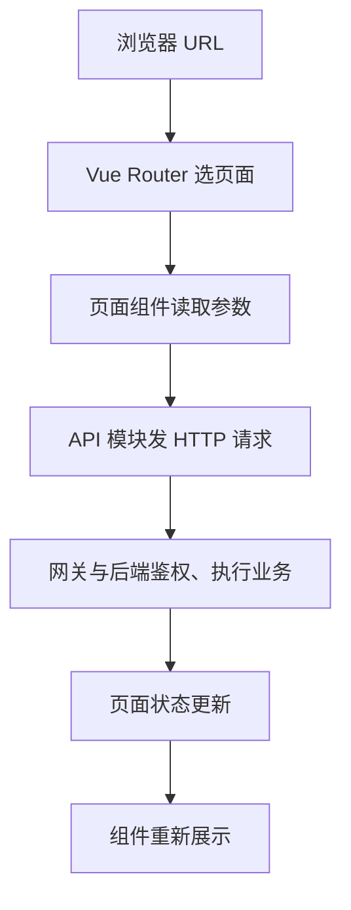

# Vue 3：云原生开发者的阅读版

> 对应[尚硅谷 Vue 3 + TypeScript 教程（71 节）](https://www.bilibili.com/video/BV1Za4y1r7KE/)。这是基于公开课程目录、Vue 官方文档和独立示例整理的阅读笔记，不是视频逐字稿。面向熟悉 Go、Kubernetes、HTTP，却希望理解前端代码分层和通信链路的读者。

**目标**：几小时读完，能顺着 URL → 页面 → 状态 → HTTP 请求 → 服务端 → 界面更新追踪一个管理后台。示例可选读，不要求动手。

## 阅读顺序

| 顺序 | 文件 | 读完后知道什么 | 预计时间 |
| --- | --- | --- | --- |
| 1 | [01-浏览器与Vue项目全貌](docs/01-浏览器与Vue项目全貌.md) | 浏览器、Vue、Vite、API 如何分工；如何找入口 | 25 分钟 |
| 2 | [02-响应式与组件](docs/02-响应式与组件.md) | ref、reactive、computed、watch；页面怎么拆 | 35 分钟 |
| 3 | [03-生命周期与路由](docs/03-生命周期与路由.md) | 何时取数、URL 如何定位页面、刷新 404 | 30 分钟 |
| 4 | [04-Pinia与组件通信](docs/04-Pinia与组件通信.md) | 全局状态、父子组件、插槽、事件总线 | 30 分钟 |
| 5 | [05-请求认证构建部署](docs/05-请求认证构建部署.md) | 点击到后端的链路、SSO、CORS、CI、部署 | 35 分钟 |
| 6 | [06-Sandbox-Portal案例](docs/06-Sandbox-Portal案例.md) | 从真实管理后台角度串联所有层次 | 35 分钟 |
| 查阅 | [07-71节逐节速查](docs/07-71节逐节速查.md) | 每一节的概念、简短代码和阅读重点 | 按需 |
| 选读 | [examples/portal](examples/portal/README.md) | 可运行的简化前端，附模拟 API | 30 分钟 |

## 最短心智模型

- **URL** 表示当前位置；**Router** 选择页面；**Pinia** 放跨页面共享的前端状态；**后端**保存业务事实。
- `ref` / `reactive` 使变化被 Vue 追踪；`computed` 推导值；`watch` 在变化时执行副作用。
- 父组件通过 `props` 传值，子组件通过 `emit` 报告事件；普通组件不用直接认识 API。
- 前端隐藏按钮只影响用户体验；AppID 归属和管理权限由服务端校验。
- Vite 在开发期提供服务、在构建期产出静态文件；生产浏览器运行构建后的 JavaScript。

## 与课程的边界

71 节覆盖工程搭建、组合式 API、响应式、生命周期、Router、Pinia、组件通信、插槽和部分高级 API。[课程官方目录](https://www.atguigu.com/video/284/)可核对节次。HTTP client、SSO、CORS、API 权限和容器发布是为了理解管理后台补充的工程内容，**不是宣称课程逐项讲授了这些内容**。文中所有 Sandbox Portal 路径、API 与字段是教学示意，不代表任何真实内部接口。

## 主要参考

- [Vue 官方指南](https://vuejs.org/guide/introduction.html)
- [Vue Router 文档](https://router.vuejs.org/)
- [Pinia 文档](https://pinia.vuejs.org/)
- [Vite 文档](https://vite.dev/guide/)
- [MDN：CORS](https://developer.mozilla.org/en-US/docs/Web/HTTP/Guides/CORS)
