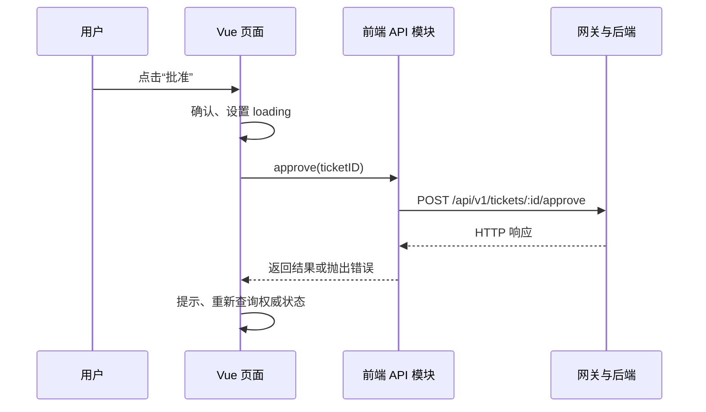

# 05｜请求、认证、构建与部署

本章是面向管理后台的工程补充；SSO、CORS、CI 等并非这套 71 节课程逐项讲解的主题。

## 1. 一个点击从浏览器走到数据库



示意 API 层：

```ts
const baseURL = import.meta.env.VITE_API_BASE_URL || '/api'

export async function approveTicket(id: string): Promise<void> {
  const response = await fetch(`${baseURL}/v1/tickets/${encodeURIComponent(id)}/approve`, {
    method: 'POST',
    credentials: 'include', // 只有既定认证方案依赖 Cookie 时才这样设置
  })
  if (!response.ok) throw new Error(`HTTP ${response.status}`)
}
```

页面应处理 `loading`、成功、错误、取消，以及服务器结果尚未最终生效的情形。请求超时不等于服务端肯定没执行；对于审批、创建等动作，后端应考虑幂等键或冲突检查，前端可重新查询权威状态。

## 2. 统一 client 层做什么

项目可用 Fetch 或 Axios。统一封装常处理 `baseURL`、默认请求头、错误结构、超时、401 跳转、请求 ID。业务 API 模块只描述“请求哪个资源”，页面只关心“收到数据后怎么显示”。

```text
View（交互与界面状态）
  → api/ticket.ts（业务端点与 DTO）
  → api/client.ts（HTTP、凭据、错误）
  → 浏览器网络栈
  → Ingress/网关/SSO/API
```

不要在组件里到处拼接生产域名或散落认证头。前端收到的 `user.role` 和 `appID` 仅用于展示判断，服务端仍需独立做授权。

## 3. SSO 的典型边界

以下只是抽象流程，实际以组织的 SSO 协议与网关为准：未登录 → 跳转身份提供方 → 认证后回到 Portal → Portal/API 得到可信会话 → `GET /me` 得到用于展示的身份与权限 → 每个敏感 API 再校验身份、角色、AppID 归属。

```text
前端能决定：展示哪些菜单、何时重定向、怎样提示无权限。
后端必须决定：当前请求是否真的可以读取/修改目标资源。
```

若使用 Cookie，会受到 `SameSite`、`Secure`、域、路径、浏览器凭据模式等条件影响。若跨源请求，CORS 是浏览器对脚本读取响应的约束；Postman 能成功不代表浏览器一定能读取。带 Cookie 的跨源请求不能简单使用 `Access-Control-Allow-Origin: *`。不要把 CORS 当认证或授权。

## 4. Vite 开发代理与生产网关

开发时 `vite.config.ts` 可能把 `/api` 代理到本地 Go 服务：

```ts
export default defineConfig({
  server: { proxy: { '/api': 'http://127.0.0.1:8080' } },
})
```

这是开发服务器的行为。`vite build` 后的浏览器不会再调用这台开发服务器的代理；生产环境要靠实际网关/Ingress/Nginx 路由或正确的 API 域名。读项目时特别检查“开发能跑，部署后为何请求错误地址”。

Vite 的 `import.meta.env.VITE_*` 通常在前端构建中使用；以它表达的值会出现在客户端产物里，**不应用作秘密凭据**。部署后只改 Pod 环境变量是否影响已构建资源，取决于项目是否另外设计了运行时配置注入。

## 5. 构建与发布

```text
CI: npm ci → npm run build → 生成 dist/
容器: 复制 dist/ 到静态 Web 服务目录
Ingress: 页面请求 → 静态服务；/api → 后端服务
浏览器: 下载 JS/CSS → 执行 Vue → 发 HTTP 请求
```

发布前端镜像和发布 API 服务是两条可协调但不同的路径。构建时的 npm registry 401 与业务 API 的 401 不在同一层。构建前者检查依赖安装凭据；浏览器中的后者检查会话与服务端鉴权。

`createWebHistory()` 要配置前端页面路径回退到 `index.html`，但 `/api` 的 404 应保持真实错误，而不是被改写为 HTML。静态资源最好有带 hash 的缓存策略，入口 HTML 则需要能及时更新；具体缓存配置由部署平台决定。

## 6. 浏览器排障顺序

| 现象 | 先查哪里 |
| --- | --- |
| 页面白屏 | Console 错误、静态资源加载、入口路由 |
| 进入页但没数据 | Network 请求 URL、状态码、响应结构、前端错误 |
| Postman 正常浏览器失败 | Cookie、CORS、预检、浏览器实际 Origin |
| 刷新详情页 404 | history 回退、Ingress 路由优先级 |
| 提交成功但列表还是旧值 | 刷新时机、缓存、异步业务状态 |
| 普通用户能直接调用管理 API | 服务端权限校验，而非仅改前端按钮 |
| `npm ci` 401 | CI 私有 npm registry 凭据 |

用 Network 面板依次读 Request URL → Method → Headers/Cookie → Payload → Response/Status → Initiator，再回到组件事件与 API 模块查代码。不要仅凭页面弹窗文字判断请求是否真正执行。
