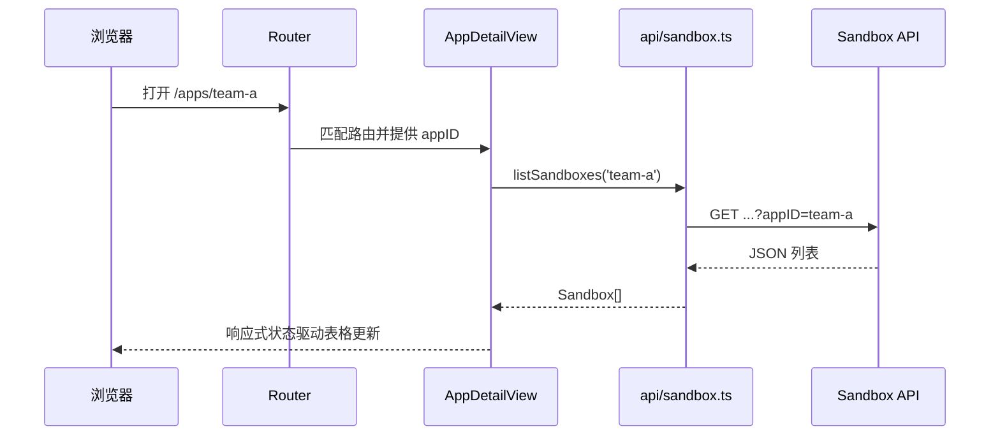

# 06｜把所有概念串成一个 Sandbox Portal

以下 API、状态、页面路径均为**教学示意**。目的在于建立前端代码和你熟悉的后端业务之间的映射，而不是复刻公司项目。

## 1. 需求与页面边界

- `/apps`：应用总览；展示当前用户可见的 AppID。
- `/apps/:appID`：应用详情；展示当前 AppID 下的 Sandbox 列表和操作。
- `/tickets`：审批单列表；管理员可按状态、用户筛选。
- `/apps/:appID/network-policy`：编辑网络策略，旁边实时预览待提交 JSON。

页面映射由 Router 定义；一个页面中可组合多个组件。API 层对服务端协议负责；普通展示组件不应到处自己拼接后端 URL。

```text
src/
├── main.ts               启动并注册插件
├── App.vue               根视图
├── router/index.ts       URL → view
├── views/                业务页面，协调页面级状态
├── components/           可复用表格、标签、弹窗
├── api/client.ts         HTTP 通用处理
├── api/sandbox.ts        Sandbox 端点
├── stores/auth.ts        跨页面身份展示状态
└── types/                TypeScript 数据形状
```

## 2. 应用详情：打开页面



页面里的典型逻辑：

```ts
const route = useRoute()
const appID = computed(() => String(route.params.appID))
const items = ref<Sandbox[]>([])
const loading = ref(false)

watch(appID, async currentID => {
  loading.value = true
  try { items.value = await listSandboxes(currentID) }
  finally { loading.value = false }
}, { immediate: true })
```

如果从 `team-a` 切到 `team-b`，`watch` 会重新请求，防止组件复用后还展示旧应用的数据。真实项目还需处理并发请求的结果乱序、错误提示与状态清空。

## 3. 停止 Sandbox：用户动作

```text
SandboxTable 按钮
→ emit('stop', sandboxID)
→ AppDetailView 显示确认
→ api/sandbox.ts 发 POST/DELETE（按实际合同）
→ 后端校验登录身份、AppID 所属、状态转换
→ 页面重新查询列表
```

前端可以基于 `status === 'Running'` 禁用某个按钮，但不能保证请求到了后端时状态仍是 Running。服务端需要原子地处理状态校验和业务操作；前端面对冲突时重新获取状态并解释给用户。

## 4. 编辑网络策略：候选配置与已生效配置

考虑同一个 `host:port` 下多个 path。适合区分三份数据：

```ts
const savedPolicy = ref<Policy | null>(null) // 最近一次从后端读取
const form = reactive<PolicyForm>({ rules: [] }) // 用户正在编辑
const preview = computed(() => normalizePolicy(form)) // 待提交预览
```

保存：`validate(form)` → `savePolicy(appID, preview.value)` → 读取后端返回或重新查询 → 更新 `savedPolicy`。`computed` 生成的预览只说明“前端准备提交什么”，不保证服务端接受、持久化、下发或实际生效。若生效有异步流程，UI 应区分保存成功与最终生效。

不要在 `normalizePolicy` 内悄悄覆盖输入；可把规则写清楚：相同 `host:port` 合并 paths、重复 path 去重、端口范围校验、路径匹配规则、空值与大小写处理。最终规则以服务端为准。

## 5. 审批状态与异步结果

审批操作至少涉及：当前表格显示的旧状态、提交中的 loading、服务端接受命令的结果、最终审批状态。按钮禁用和本地字段更新都不能替代重新查询。若你已有 `approved_failed` 或重试的状态机，前端应展示服务端定义的状态与可用动作，不自己推断下一状态。

请求超时后若直接重发，可能重复执行。后端可用幂等键、条件更新、状态机约束；前端应允许查询现状，并在安全时重试。这个问题与你做 Sandbox 回调和 at-least-once 投递的思维一致。

## 6. SSO 与身份归属

页面可从 `/me` 获取 `{ userID, role, permittedAppIDs }` 用于展示菜单和提示。用户在浏览器里能篡改页面状态，所以后端针对 `GET /apps/:appID`、`POST /sandbox/:id/stop`、审批 API 等逐个检查权限。RoleUser 强制使用请求身份对应的 AppID，不能信任用户输入的 appID。

安全边界的简写：`前端给出交互建议；服务端判定请求是否允许。` 如果页面已经隐藏了“停止”按钮，接口仍必须能拒绝未授权的直接调用。

## 7. 用浏览器工具诊断一次故障

假设列表页显示空白：

1. 看地址：实际是 `/apps/team-a` 还是意外跳到 `/apps`？
2. 看 Router：是否命中详情页，`route.params.appID` 是什么？
3. 看 Console：JS 抛错还是正常执行？
4. 看 Network：是否请求 API，URL 是否含正确 appID？
5. 看响应：是 401、403、500、CORS、JSON 结构不符，还是确实空列表？
6. 若请求成功且有数据，看 `items.value` 是否赋值，以及组件 `props` 和 `v-if` 是否挡住显示。

这套顺序把“前端没发请求”“浏览器拦住响应”“后端拒绝”“页面没展示”四种不同故障拆开。

## 8. 代码审查清单

| 问题 | 应看到的证据 |
| --- | --- |
| 页面路径和 API 路径是否被区分？ | Router 配置与 `api/` 分开 |
| appID 从哪里来？ | 路由参数或明确的用户选择；后端再授权 |
| 状态变化何时刷新？ | 修改后重新读取或使用服务端返回的权威状态 |
| 切换 appID 会不会显示旧数据？ | 参数侦听、请求取消或版本校验 |
| 未登录与无权限如何区分？ | 401 / 403 处理与后端语义一致 |
| 配置预览是否误称“已生效”？ | 候选、已保存、已生效分开 |
| 错误与 loading 是否完整？ | `try/catch/finally`，禁用重复点击 |
| 部署刷新是否 404？ | history fallback，且 `/api` 不误回退 |

可以在 [示例项目](../examples/portal/README.md) 里按以上顺序读一次可运行的代码。示例默认使用模拟 API，不访问真实 Sandbox 服务。
